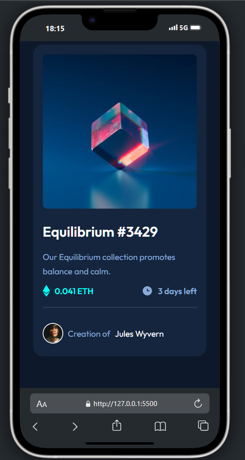
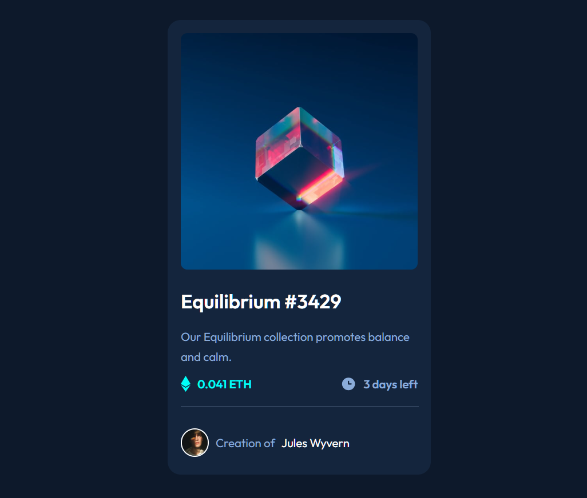

# NFT Preview Card Component

Este proyecto es una réplica del componente "NFT Preview Card" propuesto por [Frontend Mentor](https://www.frontendmentor.io/challenges/nft-preview-card-component-SbdUL_w0U), con el objetivo de practicar maquetación web utilizando HTML y CSS.


## 🧰 Tecnologías utilizadas

- HTML5
- CSS3 (Diseño responsive incluido)
- Google Fonts (Outfit)
- Diseño basado en variables CSS y Flexbox

## ✨ Características principales

- Diseño responsivo adaptable a diferentes tamaños de pantalla.
- Interacción al pasar el mouse sobre la imagen del NFT (efecto `hover` con ícono de vista).
- Uso de variables CSS para facilitar el mantenimiento del estilo.
- Estética moderna con enfoque en accesibilidad visual.

## 📁 Estructura del proyecto

NFT-preview-card-component/     
├── CSS/        
│   └── styles.css      
│       
├── design/     
│   ├── active-states.jpg       
│   ├── desktop-design.jpg      
│   └── mobile-design.jpg       
│       
├── images/     
│   ├── favicon-32x32.png       
│   ├── icon-clock.svg      
│   ├── icon-ethereum.svg       
│   ├── icon-view.svg       
│   ├── image-avatar.png        
│   └── image-equilibrium.jpg       
│       
├── .gitattributes      
├── .gitignore      
├── image-1.png     
├── image.png       
├── index.html      
├── preview.jpg     
├── README.md       
├── README-template.md      
└── style-guide.md      

## 🚀 Cómo ejecutarlo localmente

1. Clona este repositorio:
```bash
git clone https://github.com/YesidLM12/nft-preview-card.git
```

2. Navega a la carpeta del proyecto:
```bash
cd nft-preview-card
```
3. Abre el archivo index.html en tu navegador.

## 💡 Aprendizajes

Este proyecto permitió reforzar:

- El uso de Flexbox para layouts responsivos.

- El manejo de hover en imágenes con capas superpuestas.

- La organización y reutilización de estilos mediante variables CSS.

- Buenas prácticas de diseño y estructura HTML semántica.

## 📸 Vista previa

- mobile:   

- Desktop:      


## 🔗 Créditos

- Diseño original por Frontend Mentor

- Desarrollado por Yesid F. Londoño M.